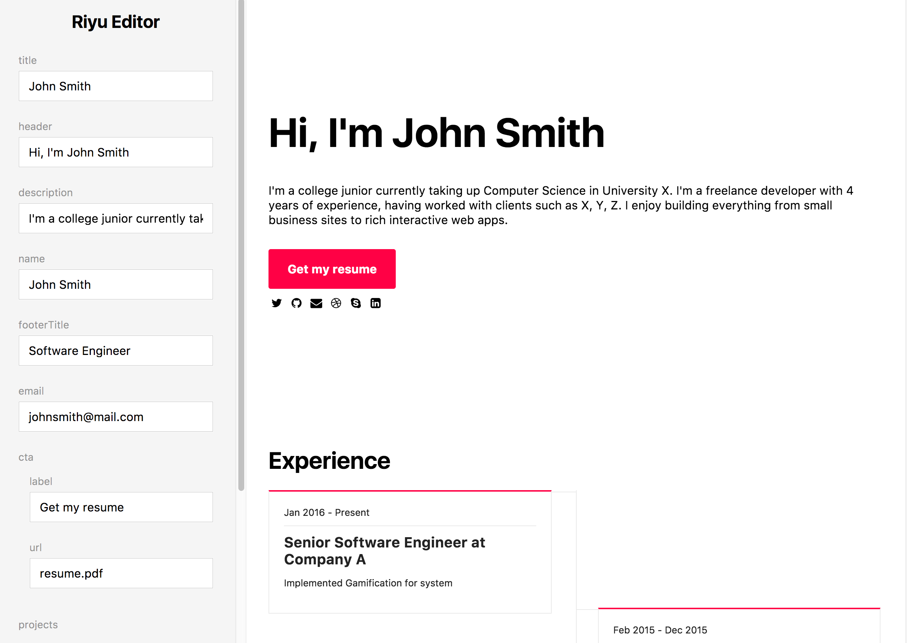

# Riyu

Riyu is a cool, modern, and minimal portfolio template that is super easy to customize.

Whether you just want to add your information to create a page or edit styles and sections to add your own flair, Riyu has you covered.

[Live Demo](https://secretmapper.github.io/Riyu/)

Live Editor



## Features

- Super lightweight and loads ridiculously fast (no external dependencies except a few font icons)
- Mobile-first and fully responsive
- Minimal and modern look
- Hack the built html template or recreate from source
- Easy to edit data file to quickly add your info in (`src/data.json`)
- Easy to edit common styles using SASS variables
- Comes with a watch and build system with no customization necessary (livereload!)
- [SASS](https://sass-lang.com/) preprocessor
- [Liquid](https://shopify.github.io/liquid/) templating (Jekyll, Nunjucks)

## Usage

You can use Riyu on two ways, by editing the raw html/css (use as is), or use data file/build system to customize Riyu more.

### Editing the raw html/css

The easiest way to edit Riku (without any setup at all) is to simply edit the built files (`index.html`) and adding your information.

### Use data file/Customize template

#### Setup

1. Fork/Clone the repo
2. Run `npm intall` or `yarn install` to install dependencies
3. Run `npm start`/`yarn`. This will start a watch server that automatically live reloads as you make edits!

You can also run `yarn build` to build your files without starting the livereload server.

#### Use data file

You can customize most of Riku's data by editing the `src/data.js` file. Excerpt:

```
  projects: [
    {
      name: 'Combustion',
      description: 'Combustion is a sleek, modern web client for the transmission bittorrent client.',
      tags: ['React', 'Javascript', 'Webpack', 'Mobx', 'CSSModules'],
      alt: 'Combustion Screenshot', // alt description of image for accessibility. defaults to '{{name}} Screenshot'
      img: 'combustion.png',
      url: '//'
    },
    {
      name: 'Merc-01',
      description: 'Merc-01 is a fast paced twin-stick shooter built on top of pyglet.',
      tags: ['Python', 'WebGL', 'Pyglet'],
      img: 'merc-01.png',
      url: '//'
    }
  ],
```

Once edited, you can run `npm run build`/`yarn build` and it will edit the `index.html` file to add your data. The watch server also watches this file so you can edit the data file while developing.

#### Customize template

Template files [liquid](https://shopify.github.io/liquid/) are located in `src/templates`, and they are built to `index.html`

SASS files are located in `src/scss` and they are built to `css/index.css`

The majority of styles are extracted, and you can easily change the Riyu's theme/colour scheme by editing the stylesheet's variables

```
$mobile: "(min-width: 460px)";
$tablet: "(min-width: 768px)";
$desktop: "(min-width: 1024px)";

$main-color: #f04;
$main-text-color: #fff;

$info-color: $main-color;
$info-text-color: white;

$tag-color: #eceff5;

$muted-color: #eaeaea;
$footer-color: black;
$footer-text-color: white;
$footer-alt-color: $main-color;
```

For example, simply edit `$main-color` to change the Riyu's main color scheme (reddish tint by default).

## License

MIT
